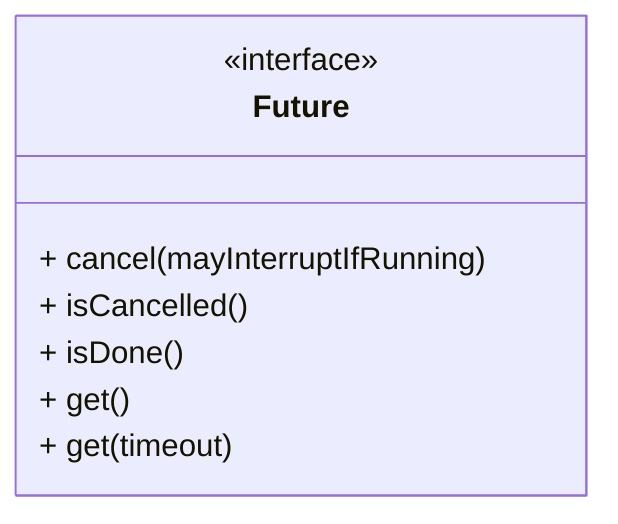

[TOC]

# Future

## 结构

```mermaid
classDiagram
  class Future {
    <<interface>>
    + cancel(mayInterruptIfRunning)
    + isCancelled()
    + isDone()
    + get()
    + get(timeout)
  }


```

​	

