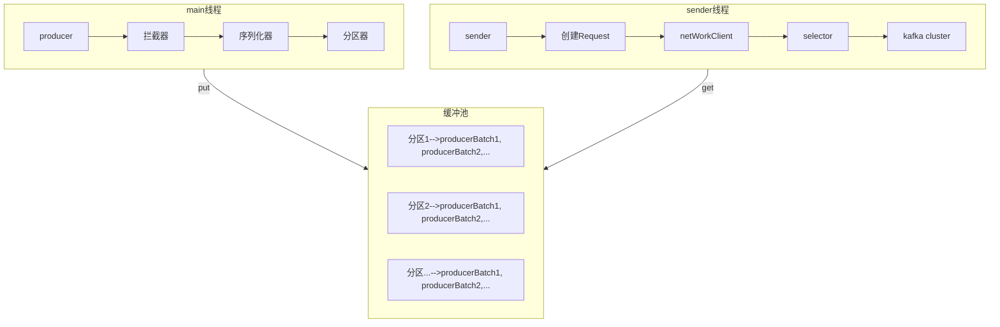

[TOC]

# kafka使用

## 一、生产者Producer

### 1. 使用流程

使用producer发送消息，可以分五步：

1. 配置连接信息
2. 构造生产者
3. 构建消息
4. 发送消息
5. 关闭生产者

**代码示例及说明**

```
// 1. 生产者配置。broker地址，序列化器等
Properties props = new Properties();
props.put("bootstrap.servers", "localhost:9092");
props.put("Key.serializer", StringSeriallizer.class.getName()); // 需要是全限定名
props.put("Value.serializer", StringSeriallizer.class.getName());

// 2. 使用配置props构造producer
KafkaProducer<String, String> producer = new kafkaProducer(props);

// 3. 构造发送消息。ProducerRecord除了topic和value，还可以指定 分区、header、key（用于分区hash）、时间戳
ProducerRecord record = new ProducerRecord("your-topic", "your message");

// 4. 发送消息。可以实现无状态、同步、异步回调
// send方法，返回体为Future<RecordMetadata>
// 无状态：忽略 res，不关心推送结果
// 同步等待：res.get(), 进行阻塞等待
// 异步回调: producer.send(record, callback)，异步回调callback函数
Future<RecordMetadata> res = producer.send()

// 5. 所有消息发送完，销毁
producer.close()
```

### 2. 流程结构

​	producer调用send()方法时，并不会一条record消息就执行一次网络请求，这样会导致频繁进行网络连接，吞吐量降低。kafka采用中间增加缓冲池的方式，每次微批发送，复用网络请求。

producer客户端可分为两个线程：一个main线程，负责将record消息封装batch，送入缓冲池。一个sender线程，负责从缓冲池读取batch数据，维护发送状态，超时等信息

**流程图**



## 二、消费者Consumer

### 1. 基础概念

#### 消费者和消费者组

一个消费者组下可以有多个消费者，每个分区只能被一个消费组中的一个消费者消费。简单来说，消费组对应topic，消费者对应分区。这样的优势在于，可以使通过增加消费者来提高消费能力，但是消费者数量最多和分区数持平，超过的消费者会分配不到任何分区。

### 2. 使用流程

编写consumer消费代码，可以简略分为几步：

1. 配置客户端参数
2. 构造consumer，并订阅主题，指定消费的topic
3. 拉取消息消费
4. 提交消费偏移
5. 关闭消费者实例

```
// 1. 配置客户端参数
Properties props = new Properties;
props.put("bootstrap.servers", "localhost:9092");
props.put("Key.serializer", StringSeriallizer.class.getName()); // 需要是全限定名
props.put("Value.serializer", StringSeriallizer.class.getName());
props.put("group.id", "消费组id");
props.put("client.id", "消费者id");

// 2. 构造consumer
KafkaConsumer<String, String> cosumer = new KafkaConsumer<>(props);
// 指定订阅主题
consumer.subscribe(Arrays.asList(topic-list));

// 3. 消费消息。kafka采用拉取模式
while(true) {
	// 可设置超时时间。没有消息时的阻塞时间
	ConsumerRecords<String, String> records = consumer.poll(Duration.ofMillis(1000));
	// ConsumerRecords.records(topic)可获取指定分区的消息
	for (ConsumerRecord record : records) {
		// do something with message
		
		// 4. 默认自动提交offset。可以通过record.offset()获取offset，自己保存
		// 也可以手动调用commitSync()同步提交和commitAsync()进行异步提交
		consumer.commitSync(); // 可选，手动同步提交
	}
}

// 5.关闭consumer客户端
consumer.close();
```

### 3. 消费提交

kafka默认为自动提交，由消费端参数`enable.auto.commit`控制。默认情况下，通过`auto.commit.interval.ms`的默认设置`5s`，在poll()函数中进行判断每5秒一次自动提交。代码简洁，但是随之而来，可能会带来数据丢失的问题。

提交偏移量不当导致的问题：

**常见问题**

1. 数据丢失

   拉取即提交。如果本次消费数据为[x+1, x+10]，poll()时便进行了提交，但是处理到x+5时出现异常，就会导致[x+5,x+10]的数据丢失

2. 重复消费

   处理完成再提交。如果本次本次消费数据为[x+1, x+10]，当处理到x+5时出现异常，服务重启消费，又会再次拉取一次[x+1, x+10]，会造成[x+1, x+5]数据的重复

**解决办法**

以上两个问题，可以根据业务场景，在提交时使用commitSync()或者commitAsnc()来进行手动提交，避免或者减轻其中某个问题。

#### 四、主题和分区

1. 只有leader副本提供读写，follow副本只是用来保证消息同步