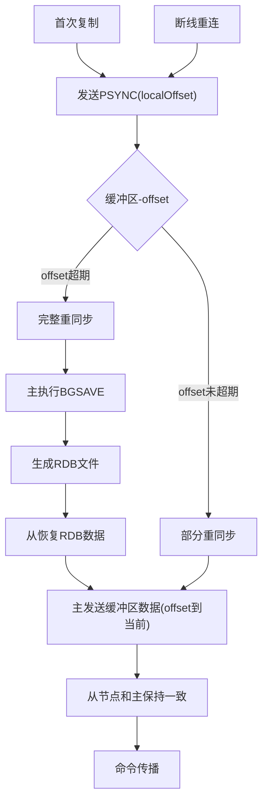
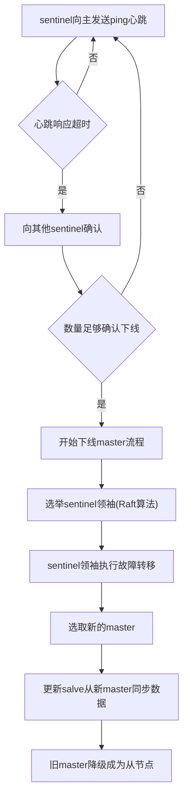

[TOC]

# Redis ——多节点高可用方案

本文介绍redis主从复制，哨兵模式，集群模式等多个redis节点协作的相关内容

## 一、主从复制

### 1. 设置主从

```
// 设置当前节点成为master的从节点
SLAVEOF <master-ip> <master-port>
```

### 2. 主从数据同步流程

主从数据同步：分为完整同步和部分同步。完整同步，通过RDB文件+缓冲区新增实现全量恢复。部分同步，通过缓冲区的缓冲数据进行部分数据恢复。流程图如下：



Notes： 
1. 命令传播，主将执行的命令广播到他的从节点，来保持主从的数据一致
2. 如果网络抖动，导致某条命令传播失败。补偿机制如下：
	a. 从节点的心跳检测： REPLACONF ACK <local offset> 会带上本机最新的offset
	b. 主会校验从的心跳，发现offset有延迟。就会从缓冲区把offset到当前的差异数据发送给从


## 二、哨兵模式Sentinel

Sentinel是Redis高可用解决方案，用一个或多个sentinel实例来监视master节点和slave节点的状态，并在master节点异常时，进行异常恢复，控制主从切换。

### 1. 设置哨兵

```
redis-sentinel /path/to/sentinel.conf
```


### 2. 运行流程




## 三、集群模式

sentinel只是解决了主从切换的高可用解决方案。但是对于大数据量的分布式问题，无能为力。所以需要集群模式，构建多个协作的master来避免单机瓶颈。

### 1. 设置集群

```
// 当前节点加入到集群
CLUSTER MEET <ip> <port>

// 分派slot，把1-5000的slot指派给当前节点处理
CLSUTER ADDSLOTS 1 ... 5000

// 为master设置从节点
CLUSTER REPLICATE <node_id>
```

### 2. 集群结构

1. 加入集群的节点，会生成ClusterNode、ClusterState等结构来保存集群和其余节点相关信息
2. 整个集群划分为16384个slot，每个节点负责处理其中一部分。当所有slot都有节点处理时，集群为上线状态

3. 客户端请求时，master会计算改命令对应的slot，如果是自身则处理。否则返回一个MOVED命令，返回对应的ip

   ```
   MOVED <slot> <ip:port>
   客户端收到MOVED响应后，再使用正确的ip:port发送命令。（redis-cli会自动隐藏MOVED这一过程）
   ```

### 3. 重新分片

把已分配的slot，重新分片给其他节点。例如：节点扩容等情况

#### 实现原理

由redis-trib负责

1. 目标节点上设置slot来源节点 `CLUSTER SETSLOT <slot> IMPORTING <SOURCE_ID> `

2. 源节点上设置导入节点 `CLUSTER SETSLOT <slot> MIGRATING <target_ID>` 

3. 获取count个源节点上该slot的键 `CLUSTER GETKEYSINSLOT <SLOT> <COUNT>`

4. 根据key逐条迁移至源节点 ： `MIGRATE <TARGET_IP> <TARGET_PORT> <KEY_NAME> 0 <TIMEOUT>`

Notes：slot数据迁移过程中，针对该slot上的新请求。会先在源节点上查找，如果源节点上不存在，会给出一个ASK错误，指引转移到目标节点上操作。

### 4. 故障转移

集群模式中，也需要设置从节点，来保证数据可用性。当某个master节点故障时，可以有对应的slave进行切换。集群的心跳检测，主从切换和哨兵模式流程类似。不同点在于，不用刻意新建sentinel哨兵来专门负责监听和切换。集群模式下，每个节点都会向其他节点发送PING消息来检测对方状态，如果对方响应超时，和哨兵一致，开始询问其他节点，超过足够数量后，认为改节点事实下线。如果下线是master节点，从对应的slave通过raft选取一个成为新的master，并把消息广播，整体流程和哨兵一致。

